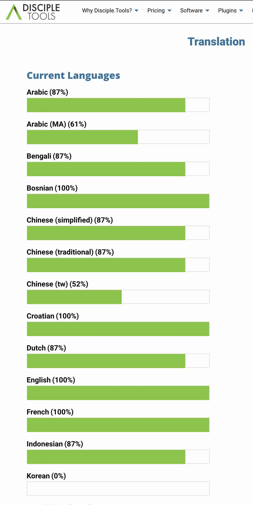

# POEditor Shortcode
This simple plugin connects to a POEditor project and gets the list and status of active languages and places it into a shortcode to be installed on a page.

It includes an administrative page so you can add your API key from POEditor and a short code tool. Can be used to display multiple projects.

## Example of Chart Read From POEditor API

View live example : [https://disciple.tools/translation/](https://disciple.tools/translation/)

